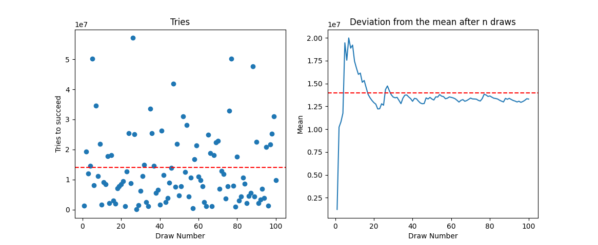

# Lottery Win Chance Estimator

This program is used to draw and plot, using the Matplotlib library, the number of attempts needed by n people to win a lottery (used the Polish Lotto as an example) and the deviation from the average number of draws needed to win (probability) after taking n people into account. There are two versions - a static one that will execute the program and provide the result when finished, and a dynamic version that will plot the data on a graph in real time.

Static version:

  
 
Dynamic version:

 

https://user-images.githubusercontent.com/91700001/172059652-3ec2c6a8-e131-4739-9c5b-00805779e92a.mp4

